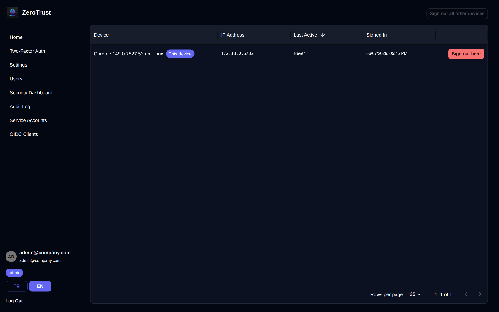
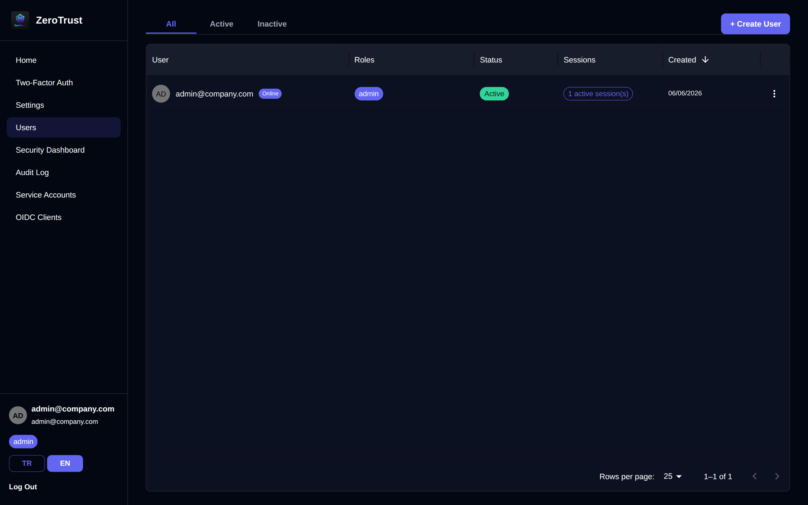
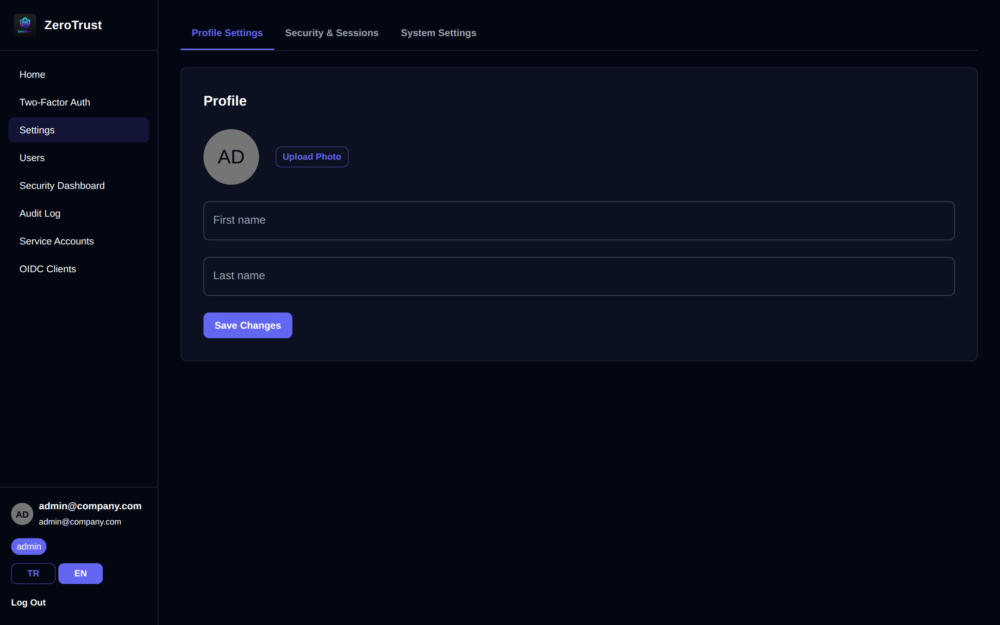

# ZeroTrust — Screenshots

> Auto-generated by `scripts/screenshots.js`. Run `make screenshots` to refresh.

---

## Login

*Secure login page with email/password, TOTP MFA, and passwordless passkey support.*

---

## Dashboard Overview

*Central dashboard with security metrics, active sessions, and quick-access navigation.*

---

## Two-Factor Authentication (MFA)

*TOTP setup with QR code scan and encrypted backup recovery codes.*

---

## Passkey Management

*Register and manage FIDO2 passkeys for phishing-resistant second-factor and passwordless login.*

---

## Session Management

*View and revoke active browser sessions across all devices in real-time.*

---

## User Management

*Admin panel for listing users, assigning roles, and managing account status.*

---

## Security Dashboard

*Aggregated authentication trends, lockouts, anomaly detection, login geography and failed-login sources.*

---

## Audit Log

*Immutable, searchable audit log of all security events with metadata.*

---

## Service Accounts (M2M)

*Create and manage machine-to-machine OAuth2 service accounts with scoped credentials.*

---

## OIDC Identity Provider

*Register and manage OIDC clients. ZeroTrust acts as a standards-compliant OpenID Connect provider with roles/groups claims.*

ZeroTrust implements the Authorization Code flow with PKCE (S256, RFC 7636). Registered clients receive an authorization code on user consent, exchange it for an Ed25519-signed ID token and access token, and use the `refresh_token` grant (RFC 6749 §6) with `offline_access` scope to obtain long-lived rotating refresh tokens. Tokens can be introspected via `POST /oauth2/introspect` (RFC 7662) and revoked via `POST /oauth2/revoke` (RFC 7009). The `max_age` parameter (OIDC Core §3.1.2.1) enforces re-authentication when a session exceeds a client-specified age. Live profile claims are available at `/oauth2/userinfo`. All consent decisions, token exchanges, rotations, introspections, and revocations are written to the audit log. The discovery document at `/.well-known/openid-configuration` advertises all supported endpoints, scopes, and signing algorithms.

---

## Settings

*Configure session policies, password complexity, MFA enforcement, and other system-wide security settings.*

---
